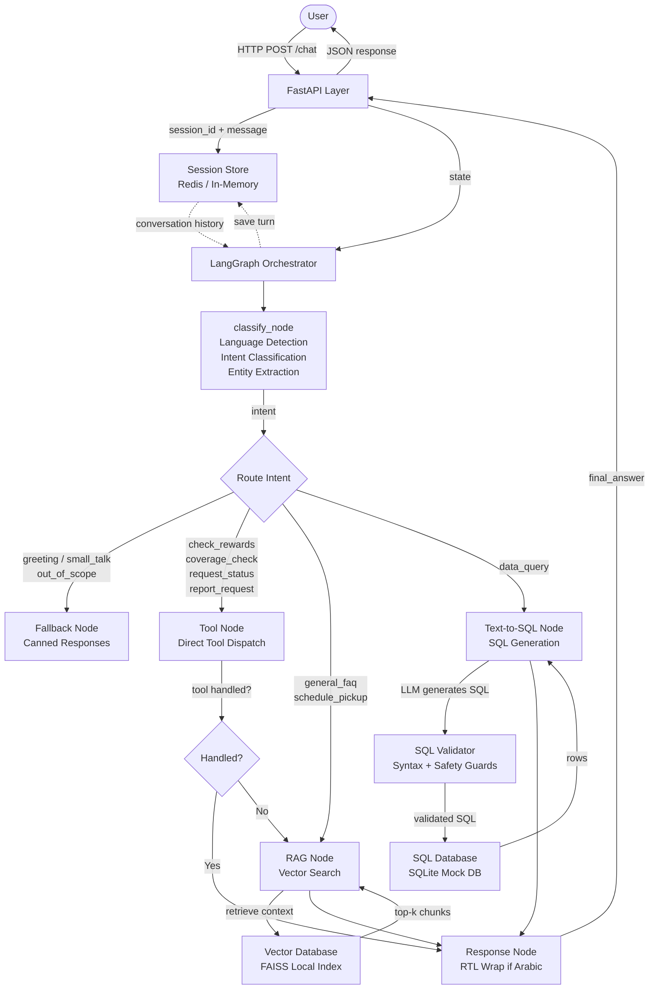

# Architecture — Backoffice AI Chatbot Demo

This document describes the high-level architecture of the Backoffice AI Chatbot demonstration system.

> [!NOTE]
> This is a sanitized, independently implemented demonstration. It does not reflect the exact architecture of any production system. All service names are generic.

---

## End-to-End Request Flow



---

## Component Descriptions

### FastAPI Layer
- Exposes `/chat`, `/health`, `/session/{id}` endpoints
- Pydantic request/response validation
- CORS middleware for cross-origin requests
- Auto-generates `session_id` (UUID) if not provided by client

### Session Store
- **Primary**: Redis (configured via `REDIS_URL` env var)
- **Fallback**: Thread-safe in-memory dict (auto-selected when Redis is unavailable)
- Stores conversation history as `[{role, content, timestamp}]` per session
- Sliding window: last 20 turns per session

### LangGraph Orchestrator
- Defines a `StateGraph` with typed state (`ChatState`)
- Nodes are pure Python functions that read/write state dicts
- Conditional edges route based on classified intent
- Single `compile()` call produces a reusable `.invoke(state)` graph

### classify_node
- **Language detection**: Unicode Arabic character ratio → `"en"` or `"ar"`
- **Fast-path keywords**: Greetings, small talk, and common patterns resolved without an LLM call
- **LLM classification**: Structured JSON output for complex queries (10 demo intents)
- **Entity extraction**: city, user_id, dates, material category

### Tool Node
- Dispatches to named mock tools based on intent
- Tools query the local SQLite database only
- Returns structured `{success, data, message}` dicts

### RAG Node
- **Embedding model**: `all-MiniLM-L6-v2` (sentence-transformers, runs locally, no API key)
- **Vector store**: FAISS `IndexFlatIP` (inner product = cosine similarity on normalized vectors)
- **Chunking**: Character-level with 50-char overlap
- **Deduplication**: Max 1 chunk per source document in results
- **Context-only polishing**: LLM instructed to use ONLY retrieved context (sentinel token pattern)

### Text-to-SQL Node
- Prompt includes: today's date, schema, 8 few-shot examples, 8 strict rules
- LLM generates a `SELECT` statement
- **Dual validation**:
  - Must start with `SELECT` or `WITH`
  - Forbidden DML/exec keywords blocked
  - PII columns blocked
  - Must reference at least one known table
- Up to 2 retries with error feedback injected into prompt

### SQL Database (Mock)
- SQLite with 3 tables: `users`, `requests`, `rewards`
- 15 fictional users, 20 fictional requests, 24 fictional reward records
- Entirely fictional data — no real individuals or companies

### Response Node
- Wraps Arabic responses in `<div dir='rtl'>` for correct rendering
- Returns `final_answer` string

---

## State Schema

```python
class ChatState(TypedDict):
    user_message : str              # Raw user input
    session_id   : str              # Session identifier
    language     : str              # "en" or "ar"
    intent       : str              # Classified intent
    entities     : dict             # Extracted entities
    tool_result  : dict | None      # Tool execution result
    rag_context  : str  | None      # Retrieved FAQ context
    sql_result   : list | None      # SQL query rows
    sql_used     : str  | None      # Executed SQL statement
    answer       : str  | None      # Intermediate answer
    handled_by   : str  | None      # Which node produced the answer
    final_answer : str              # Final response to user
```

---

## Intent Routing Table

| Intent | Route | Handler |
|--------|-------|---------|
| `greeting` | Fallback Node | Canned greeting |
| `small_talk` | Fallback Node | LLM casual reply |
| `out_of_scope` | Fallback Node | Redirect message |
| `general_faq` | RAG Node | FAISS retrieval → LLM polish |
| `schedule_pickup` | RAG Node | FAISS retrieval → LLM polish |
| `check_rewards` | Tool Node | `get_user_rewards()` |
| `coverage_check` | Tool Node | `check_service_coverage()` |
| `request_status` | Tool Node | `get_request_status()` |
| `report_request` | Tool Node | `get_platform_summary()` |
| `data_query` | Text-to-SQL Node | LLM SQL → SQLite |

---

## Technology Stack

| Component | Technology |
|-----------|-----------|
| API Framework | FastAPI |
| Workflow Orchestration | LangGraph |
| LLM Client | LangChain + OpenAI |
| Local Embeddings | sentence-transformers (all-MiniLM-L6-v2) |
| Vector Store | FAISS (faiss-cpu) |
| Mock Database | SQLite |
| Session Store | Redis (in-memory fallback) |
| Testing | pytest |

---

## Security Design Principles

1. **No production credentials** — all configuration via env vars (`.env.example` only)
2. **No external data sources** — SQLite local mock DB only
3. **SQL guardrails** — `SELECT`-only enforcement, forbidden keyword list, PII column blocklist
4. **Context-only RAG** — LLM instructed not to use world knowledge
5. **No company-specific data** — entirely fictional domain, names, and cities

